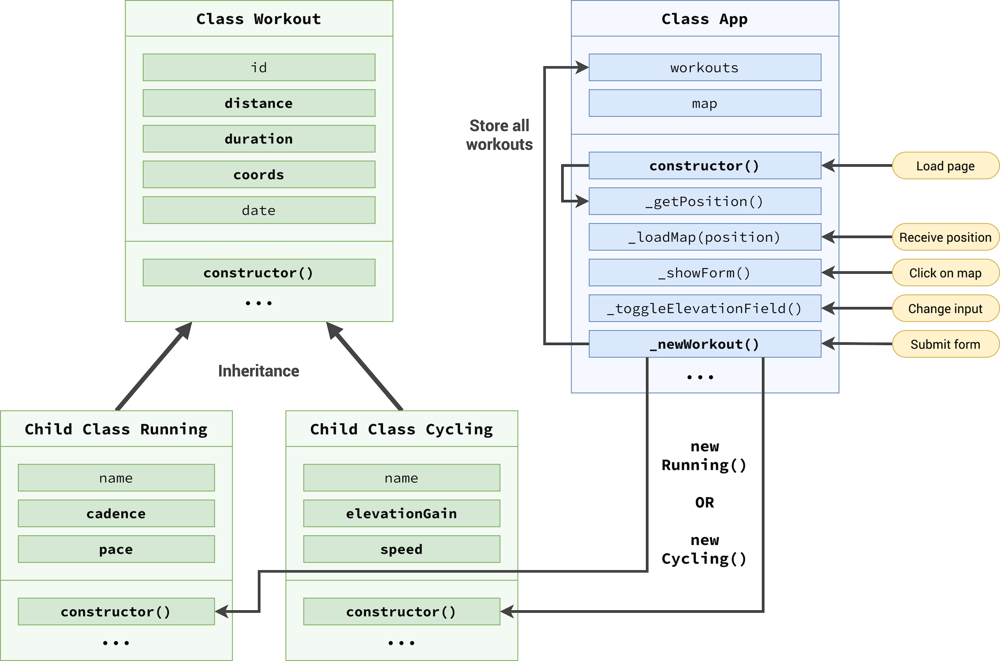

## Project Architecture & Refactoring The Code



This is refactoring with OOP Paradigm ES6 Classes 👾

> need reading a lot about this topic

Result:

```js
class App {
  // Private fields
  #map;
  #mapEvent;

  constructor() {
    // Instan Running
    this._getPositon();

    // DOM
    form.addEventListener('submit', this._newWorkout.bind(this));

    inputType.addEventListener('change', this._toggleElevation);
  }

  //------------------ Horizon Line ---------------------//

  _getPositon() {
    if (navigator.geolocation)
      navigator.geolocation.getCurrentPosition(
        this._loadMap.bind(this), // bind Method for pointng to _getLocation
        function () {
          // set if not allow
          alert('Can get your Location!');
        }
      );
  }

  _loadMap(position) {
    // set if allow
    const { latitude } = position.coords;
    const { longitude } = position.coords;
    const coords = [latitude, longitude];
    console.log(`https://www.google.com/maps/@${latitude},${longitude}`);

    this.#map = L.map('map').setView(coords, 13); // set map

    L.tileLayer('https://tile.openstreetmap.org/{z}/{x}/{y}.png', {
      attribution:
        '&copy; <a href="https://www.openstreetmap.org/copyright">OpenStreetMap</a> contributors',
    }).addTo(this.#map);

    L.marker(coords)
      .addTo(this.#map)
      .bindPopup('A pretty CSS popup.<br> Easily customizable.')
      .openPopup();

    // Handling clicks on map
    this.#map.on('click', this._showForm.bind(this));
  }

  _showForm(mapE) {
    this.#mapEvent = mapE;
    form.classList.remove('hidden');
    inputDistance.focus();
  }

  _toggleElevation() {
    inputElevation.closest('.form__row').classList.toggle('form__row--hidden');
    inputCadence.closest('.form__row').classList.toggle('form__row--hidden');
  }

  _newWorkout(event) {
    event.preventDefault();
    // clear input fields
    inputDistance.value =
      inputDuration.value =
      inputCadence.value =
      inputElevation.value =
        '';

    // Display Marker
    const { lat, lng } = this.#mapEvent.latlng;
    L.marker([lat, lng])
      .addTo(this.#map)
      .bindPopup(
        L.popup({
          maxWidth: 250,
          minWidth: 100,
          autoClose: false,
          closeOnClick: false,
          className: 'running-popup ',
        })
      )
      .setPopupContent('Workout')
      .openPopup();
  }
}

// Set app
const app = new App();
```

[Next: Managing Workout Data: Creating Classes](./managing-workout-data-creating-classes.md)
